# BIM3007-Assignment 2

Author: Junyang Deng 120090791

### Question1

**Requirement.** Please perform the *Genome Assembly, Genome Polishing and Genome Evaluation* on the Escherichia coli genome (Genome size = 4.8 Mb) based on Nanopore reads https://figshare.com/ndownloader/files/21623145 and Illumina pair-end reads ``ftp://ftp.sra.ebi.ac.uk/vol1/fastq/SRR987/006/SRR9873306/SRR9873306_1.fastq.gz`` and ``ftp://ftp.sra.ebi.ac.uk/vol1/fastq/SRR987/006/SRR9873306/SRR9873306_ 2.fastq.gz``.

You should provide the results of contig N50, contig L50, the size of the largest contig, assembled genome size, GC content and BUSCOs of the assembled and polished genomes. Besides, you also need to provide your analysis process.

#### Procedure

**Required softwares:**

- canu

- quast: evaluate

- BUSCO (can be installed using `conda install busco=5.3.2`): evaluate

- quast: evaluate

- BUSCO (can be installed using `conda install busco=5.3.2`): evaluate genome quality

- fastp (quality control for illumina reads)

- samtools

- bwa

- pilon

1. Download the files

2. Assemble the reads

```bash
canu -p ecoli -d ecoli-nanopore genomeSize=4.8m -nanopore-raw nanopore.fastq 
# assemble nanopore reads
# -p prefix
# -nanopore-raw nanopore reads without polishing
```

3. Evaluate the first assembly

```bash
conda activate quast
cd ecoli.contigs.fasta_quast/
less report.txt
```

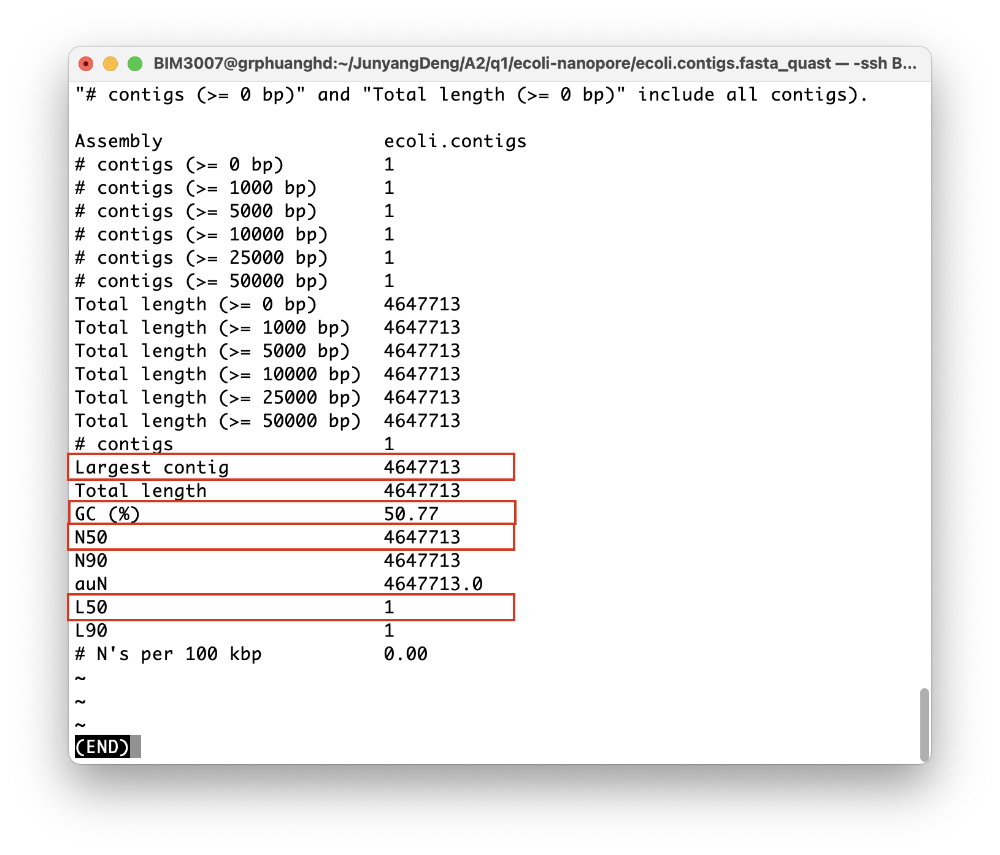

4. Evaluate the assembly using BUSCO

```bash
conda activate busco
# use two references to check
busco -i ecoli.contigs.fasta -l bacteria -c 8 -o ecoli.contigs.fasta_busco -m geno -f
busco -i ecoli.contigs.fasta -l enterobacterales_odb10 -c 8 -o ecoli.contigs.fasta_busco -m geno -f 
```

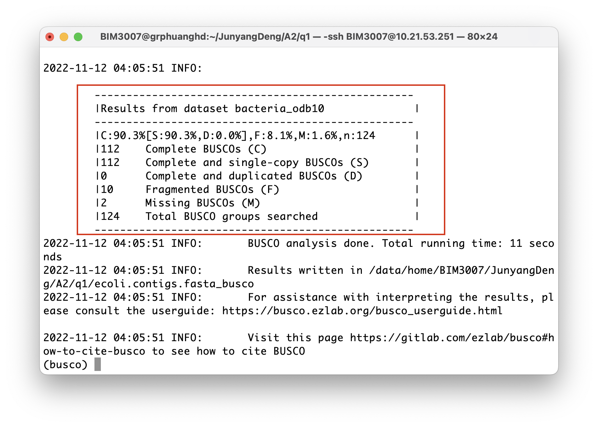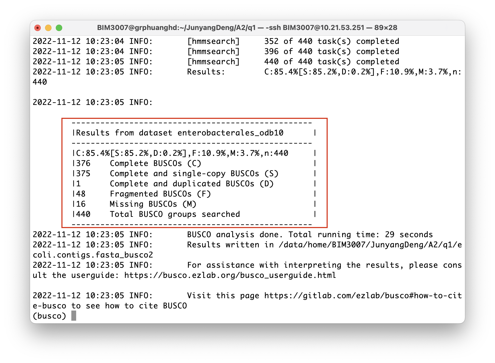

5. Perform genome polishing

Quality control of the illumina reads

fastp is a  tool designed to provide fast all-in-one preprocessing for FastQ files. This tool is developed in C++ with multithreading supported to afford high performance. https://github.com/OpenGene/fastpfastp (quality control for illumina reads)

- samtools

- bwa

```bash
fastp -q 30 -5 -l 100 -i illumina1.fastq -I illumina2.fastq -o illumina_clean_1.fastq -O illumina_clean_2.fastq 
# inputs options
# -i (input1) -I (input2) -o (output1) -O (output2)
# -q, --qualified_quality_phred: the quality value that a base is qualified. Default 15 means phred quality >=Q15 is qualified.
# -u, --unqualified_percent_limit   how many percents of bases are allowed to be unqualified (0~100). Default 40 means 40%
# -l, --length-required  the minimum length requirement
# -5, --cut_front move a sliding window from front (5') to tail, drop the bases in the window if its mean quality is below cut_mean_quality, stop otherwise. Default is disabled. The leading N bases are also trimmed.
```

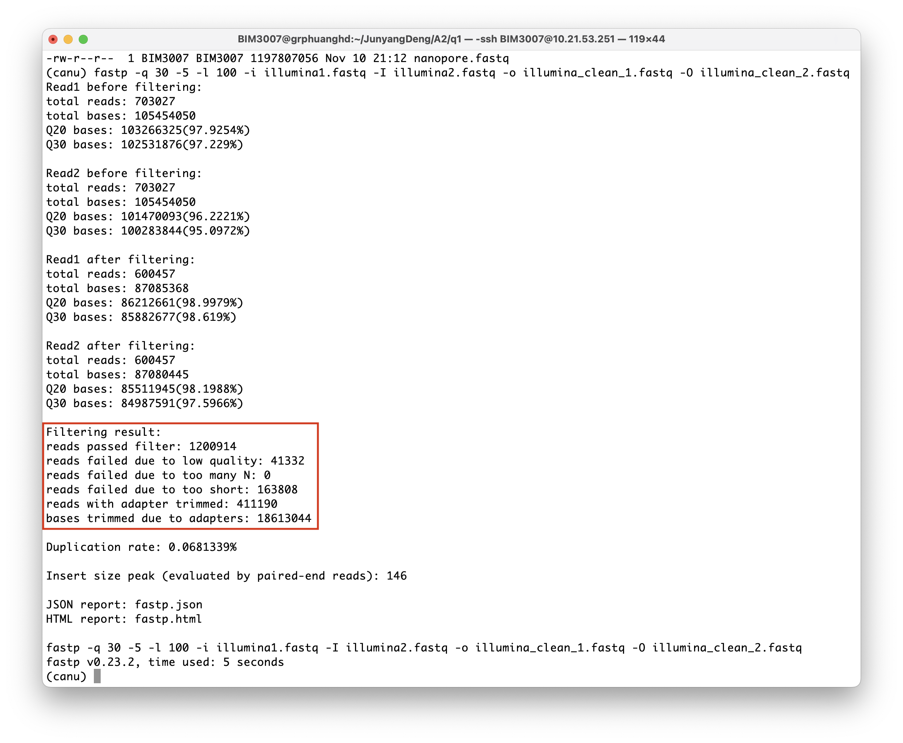

Use BWA to index `.fasta`

```bash
bwa index ecoli.contigs.fasta
```

Output: 

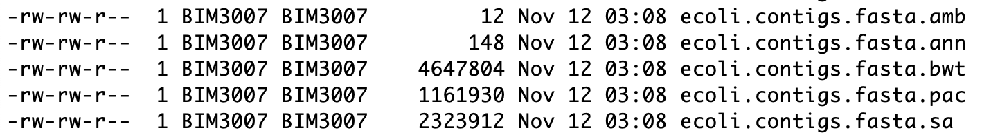

Polishing

```bash
bwa mem -t 4 ecoli.contigs.fasta illumina_clean_1.fastq illumina_clean_2.fastq | samtools sort -@ 4 > pilon.bam
samtools index -@ 4 pilon.bam
pilon --genome ecoli.contigs.fasta --frags pilon.bam --fix bases --output pilon
```

Output: `pilon.fasta` (this is the polished genome)

6. Evaluate the polished genome

```bash
# evaluate using quast
conda activate quast
cd pilon.fasta_quast/
less report.txt
```

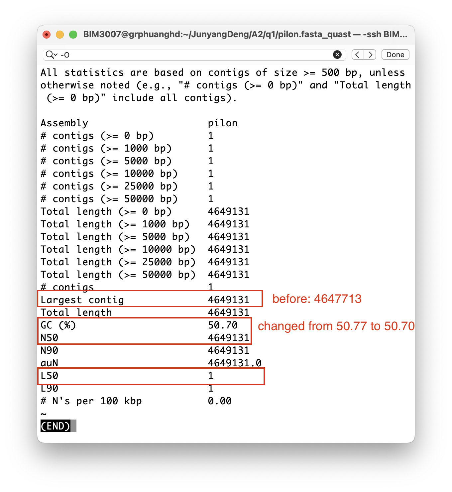

```bash
canu -p ecoli -d ecoli-nanopore genomeSize=4.8m -nanopore nanopore.fastq # nanopore
```

3. Evaluate the first assembly

```bash
conda activate quast
cd ecoli.contigs.fasta_quast/
less report.txt
```


4. Evaluate the assembly using BUSCO

```bash
conda activate busco
busco -i ecoli.contigs.fasta -l bacteria -c 8 -o ecoli.contigs.fasta_busco -m geno -f
busco -i ecoli.contigs.fasta -l enterobacterales_odb10 -c 8 -o ecoli.contigs.fasta_busco -m geno -f # use two references to check
```


5. Perform genome polishing

Quality control of the illumina reads

```bash
fastp -q 30 -5 -l 100 -i illumina1.fastq -I illumina2.fastq -o illumina_clean_1.fastq -O illumina_clean_2.fastq 
```


Use BWA to index `.fasta`

```bash
bwa index ecoli.contigs.fasta
```

Output: 


```bash
bwa mem -t 4 ecoli.contigs.fasta illumina_clean_1.fastq illumina_clean_2.fastq | samtools sort -@ 4 > pilon.bam
samtools index -@ 4 pilon.bam
pilon --genome ecoli.contigs.fasta --frags pilon.bam --fix bases --output pilon
```

Output: `pilon.fasta`

6. Evaluate the polished genome

```bash
# evaluate using quast
conda activate quast
cd pilon.fasta_quast/
less report.txt
```


```bash
conda activate busco
busco -i pilon.fasta -l bacteria -c 8 -o pilon.fasta_busco -m geno -f
busco -i pilon.fasta -l enterobacterales_odb10 -c 8 -o pilon.fasta_busco2 -m geno -f
# -i input
# -l lineage
# -c cpu
# -o output
# -m geno (genome)
# -f force
```

Result:

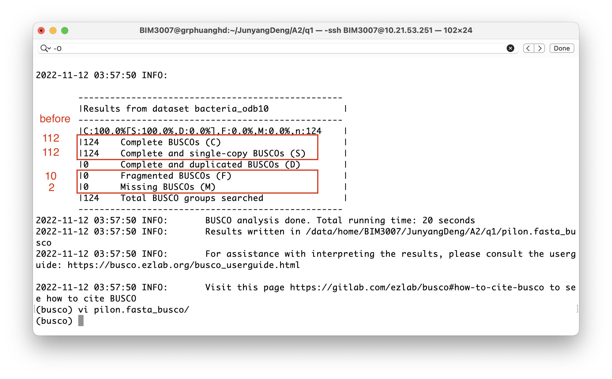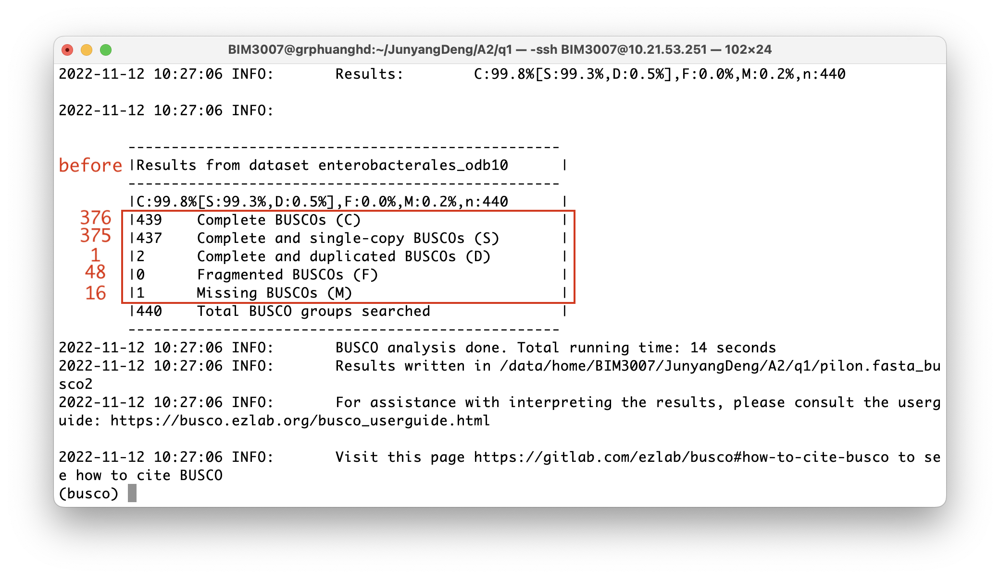

Result:


#### Results

According to the report from `quast`, the polished genome has larger contigs (changed from 4647713 to 4649131).

According to the report from `BUSCO`, the polished genome has more complete BUSCOs, less fragmented and missing BUSCOs on two different references (bacteria_odb10.

According to the report from `quast`, the polished genome has larger contigs (changed from 4647713 to 4649131).

According to the report from `BUSCO`, the polished genome has more complete BUSCOs, less fragmented and missing BUSCOs on two different references (`bacteria_odb10`, `enterbacterales_odb10`)

### Question 2

#### Requirement.

Please compute and give the results of the standard z-scores, NCV scores and regression based z-scores (RBZ) on chromosome 13, 18 and 21 based on the test dataset https://github.com/molgenis/NIPTeR/raw/master/test_samples/Trisomy21.rds and the control dataset https://github.com/molgenis/NIPTeR/raw/master/test_samples/NIPTeR_cleaned_87_controls.rds. Next, you need to justify whether this test sample has the disease (if it suffers the disease, please provide the type of disease), and give the reason.

#### Procedure

Required packages:

- R (3.4.3)

  - sets

  ```R
  install.packages("sets")
  ```

  - Rsamtools

  ```R
  source("http://bioconductor.org/biocLite.R") 
  biocLite("Rsamtools")
  ```

  - NIPTeR

  ```R
  install.packages("NIPTeR")
  ```

1. Download data from links and change the filenames

```bash
wget https://github.com/molgenis/NIPTeR/raw/master/test_samples/Trisomy21.rds
wget https://github.com/molgenis/NIPTeR/raw/master/test_samples/NIPTeR_cleaned_87_controls.rds
mv Trisomy21.rds test.rds
mv NIPTeR_cleaned_87_controls.rds control.rds
```

Current files:

```
control.rds  test.rds
```

2. Read into control

First activate `R` by typing R in command line

```R
# load library
library("NIPTeR")

# the original input is BAM file, convert to nipt object
control <- readRDS(file="control.rds")
test <- readRDS(file='test.rds')
# Correction values of GC
bingc_control <- gc_correct(nipt_object=control, method='bin')
bingc_test <- gc_correct(nipt_object=test, method='bin')
# Chi-square test correction
NIPT_bin_chi_corrected_data <- chi_correct(nipt_sample=bingc_sample, control_group=bingc_control_group)
bin_chi_corrected_sample <- bin_chi_corrected_data$sample
bin_chi_corrected_controls <- bin_chi_corrected_data$control_group
```

```R
# Count z-score on chromosome 13, 18 and 21
z_score_13 <- calculate_z_score(nipt_sample = bin_chi_corrected_sample, nipt_control_group=bin_chi_corrected_controls, chromo_focus=13)
z_score_13$sample_Zscore

# (repeat for 18 and 21)
```

```R
# calculate NCV score
ncv_template_13 <- prepare_ncv(nipt_control_group=bin_chi_corrected_controls, chr_focus=13, max_elements=9, use_test_train_set=F)
ncv_score_13 <- calculate_ncv_score(nipt_sample=bin_chi_corrected_sample, ncv_template=ncv_template_13)
ncv_score_13$sample_score

# (repeat for 18 and 21)
```

```R
# calculate regression-based z-score (RBZ)
RBZ_13 <- perform_regression(nipt_sample=bin_chi_corrected_sample, nipt_control_group=bin_chi_corrected_controls, use_test_train_set=F, chromo_focus=13)
RBZ_13$prediction_statistics

# (repeat for 18 and 21)
```

#### Results

##### Summary

|           | chr13     | chr18     | chr21    |
| --------- | --------- | --------- | -------- |
| z-score   | -1.454305 | -1.2      | 8.889812 |
| NCV score | -1.944748 | -1.208041 | 9.348512 |

Regression-based z-score:

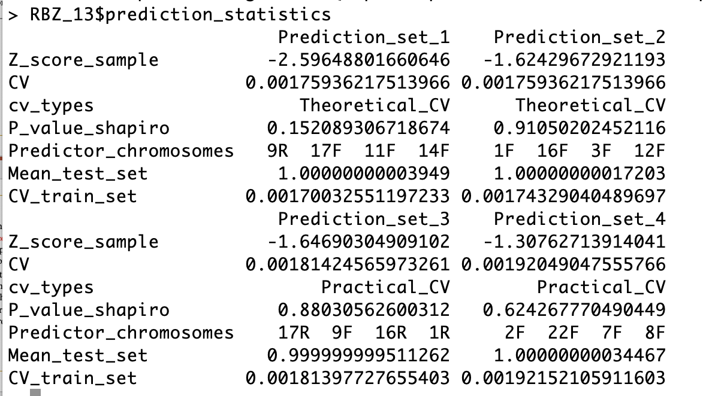

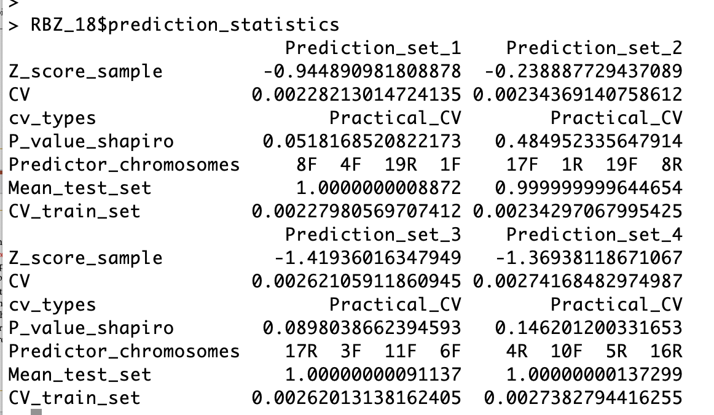

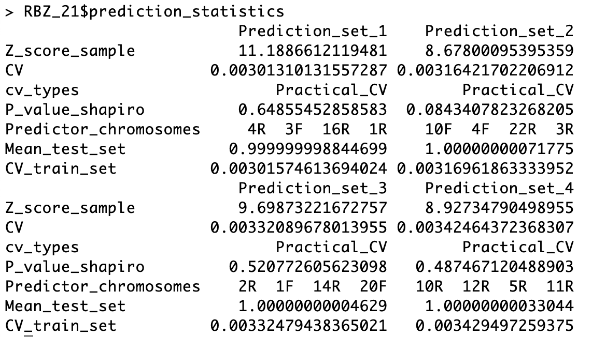

##### Disease State

This person suffers from Trisomy 21 (Down syndrome), as denoted by he abnormal z-score, NCV score and regression-based z-score. Normally, z-score ranges from $-3$ to $3$. Chromosome 21 has a z-score of $8.8$, which exceeds the normal range. Besides z-score, the NCV score and RBZ of chromsome 21 are both significantly higher than chromosome 13 and 18. Therefore, it's quite sure that this person has **Down syndrome**.

### Question 3

#### Requirement

Given pair-end reads (`test_1.fastq` and `test_2.fastq`) and structure variation reference databases (`Mills_and_1000G_gold_standard.indels.hg38.vcf`, `dbSNP_138.hg19.vcf` and `Homo_sapiens_assembly38.known_indels.vcf`) in [Server IP:`10.21.53.251`; Account: BIM3007; Password: BIM3007], please perform variant calling for chromosome 17 and provide the analysis process.

#### Procedure

1. QC

```bash
fastqc test_1.fastq
fastqc test_2.fastq 
```

Following figures are generated by the codes.

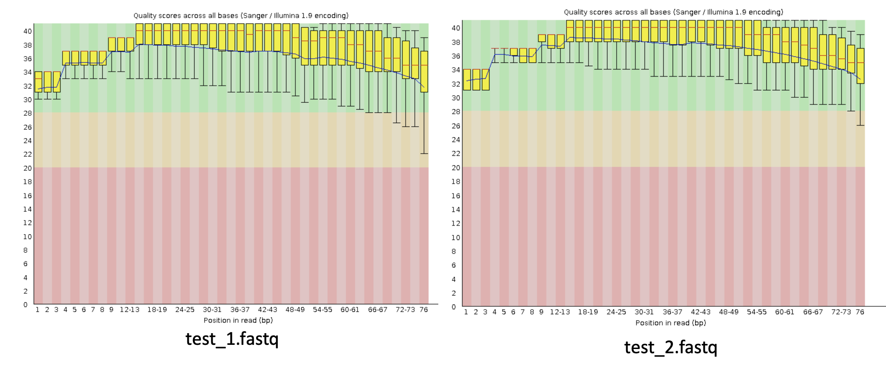

2. Mapping

```bash
# build an index of reference genome
bwa index chr17.fa 
# Map the pair reads to the genome
bwa mem -M -R "@RG\tID:1\tPL:illumina\tPU:1064\tSM:test" chr17.fa test_1.fastq test_2.fastq | samtools sort > test.sorted.bam
```

3. remove duplicate

```bash
picard MarkDuplicates \
I=test.sorted.bam \
O=test.sorted.deduped.bam \
CREATE_INDEX=TRUE \
REMOVE_DUPLICATES=TRUE  \
ASSUME_SORTED=TRUE  \
VALIDATION_STRINGENCY=LENIENT \
METRICS_FILE=testss.duplicates # output metric file name

less tests.duplicates
```

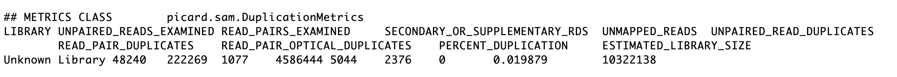

4. Local alignment

```bash
# create index
samtools faidx chr17.fa
# create dictionary
picard CreateSequenceDictionary R=chr17.fa O=chr17.dict
# target creator
gatk3  -T RealignerTargetCreator -R chr17.fa \
-I test.sorted.deduped.bam \
-known Homo_sapiens_assembly38.known_indels.vcf \
-known Mills_and_1000G_gold_standard.indels.hg38.vcf \
-o test.realign.intervals -S LENIENT
# realignment
gatk3 -T IndelRealigner \
 -R chr17.fa \
 -I test.sorted.deduped.bam \
 -targetIntervals test.realign.intervals \
 -known Homo_sapiens_assembly38.known_indels.vcf \
 -known Mills_and_1000G_gold_standard.indels.hg38.vcf \
 -o test.sorted.deduped.realigned.bam -S LENIENT
```

5. Base quality recalibration 

```bash
# build model
gatk3  \
-T BaseRecalibrator \
-R chr17.fa \
-l INFO \
-I test.sorted.deduped.realigned.bam \
-knownSites Homo_sapiens_assembly38.known_indels.vcf \
-knownSites Mills_and_1000G_gold_standard.indels.hg38.vcf \
-o test.recalibration_report.grp \
-S LENIENT -L chr17:10000000-11000000

# adjust score
gatk3 \
 -T PrintReads \
 -R chr17.fa \
 -l INFO -I test.sorted.deduped.realigned.bam \
 -BQSR test.recalibration_report.grp \
 -o test.sorted.deduped.realigned.recalibrated.bam \
 -S LENIENT -L chr17:10000000-11000000
```

6. Variant discovery and genotyping

```bash
gatk3\
  -T HaplotypeCaller \
  --emitRefConfidence GVCF \
  --variant_index_type LINEAR \
  --dbsnp dbSNP_138.hg19.vcf \
  -R chr17.fa  \
  -I test.sorted.deduped.realigned.recalibrated.bam \
  -o test.gvcf  \
  -variant_index_parameter 128000 \
  -Xmx60G # to adjust the memory allocation
```


7. Hard filtering

```bash
gatk3 \
-T VariantFiltration \
-R chr17.fa \
-l INFO \
-V dbSNP_138.hg19.vcf \
--filterExpression "DP<10 || MQ < 40.0" \
--filterName "FAILED" \
-o Combined.filtered_snps.vcf

# WARN  05:35:14,195 Interpreter - ![11,13]: 'DP < 10 || MQ < 40.0;' undefined variable MQ
```

8. View the variant # output metric file name

less tests.duplicates
```


4. Local alignment

```bash
# create index
samtools faidx chr17.fa
# create dictionary
picard CreateSequenceDictionary R=chr17.fa O=chr17.dict
# target creator
gatk3  -T RealignerTargetCreator -R chr17.fa \
-I test.sorted.deduped.bam \
-known Homo_sapiens_assembly38.known_indels.vcf \
-known Mills_and_1000G_gold_standard.indels.hg38.vcf \
-o test.realign.intervals -S LENIENT
# realignment
gatk3 -T IndelRealigner \
 -R chr17.fa \
 -I test.sorted.deduped.bam \
 -targetIntervals test.realign.intervals \
 -known Homo_sapiens_assembly38.known_indels.vcf \
 -known Mills_and_1000G_gold_standard.indels.hg38.vcf \
 -o test.sorted.deduped.realigned.bam -S LENIENT
```

5. Base quality recalibration 

```bash
# build model
gatk3  \
-T BaseRecalibrator \
-R chr17.fa \
-l INFO \
-I test.sorted.deduped.realigned.bam \
-knownSites Homo_sapiens_assembly38.known_indels.vcf \
-knownSites Mills_and_1000G_gold_standard.indels.hg38.vcf \
-o test.recalibration_report.grp \
-S LENIENT -L chr17:10000000-11000000

# adjust score
gatk3 \
 -T PrintReads \
 -R chr17.fa \
 -l INFO -I test.sorted.deduped.realigned.bam \
 -BQSR test.recalibration_report.grp \
 -o test.sorted.deduped.realigned.recalibrated.bam \
 -S LENIENT -L chr17:10000000-11000000
```

6. Variant discovery and genotyping

```bash
gatk3\
  -T HaplotypeCaller \
  --emitRefConfidence GVCF \
  --variant_index_type LINEAR \
  --dbsnp dbSNP_138.hg19.vcf \
  -R chr17.fa  \
  -I test.sorted.deduped.realigned.recalibrated.bam \
  -o test.gvcf  \
  -variant_index_parameter 128000 \
  -Xmx60G # to adjust the memory allocation
```


7. Hard filtering

```bash
gatk3 \
-T VariantFiltration \
-R chr17.fa \
-l INFO \
-V dbSNP_138.hg19.vcf \
--filterExpression "DP<10 || MQ < 40.0" \
--filterName "FAILED" \
-o Combined.filtered_snps.vcf

# WARN  05:35:14,195 Interpreter - ![11,13]: 'DP < 10 || MQ < 40.0;' undefined variable MQ
```

Output: 

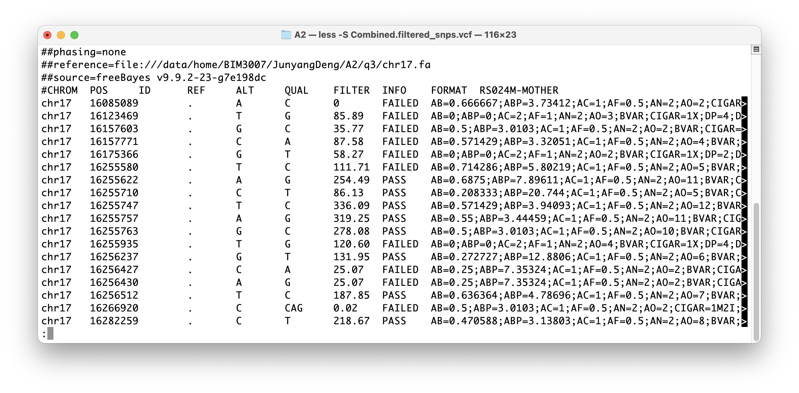

8. Interpret the variant

Extract variants from `vcf` file

```bash
grep 'PASS' Combined.filtered_snps.vcf > var.chr17.txt
wc -l var.chr17.txt
```

Result:

`2298 var.chr17.txt`

#### Result

Submit the variants (in `Combined.filtered_snps.vcf` ) to `wANNOVAR` (https://wannovar.wglab.org). Outputs are `query.output.exome_summary.txt`, `query.output.exome_summary.csv`, `query.output.genome_summary.txt`,`query.output.genome_summary.csv`.


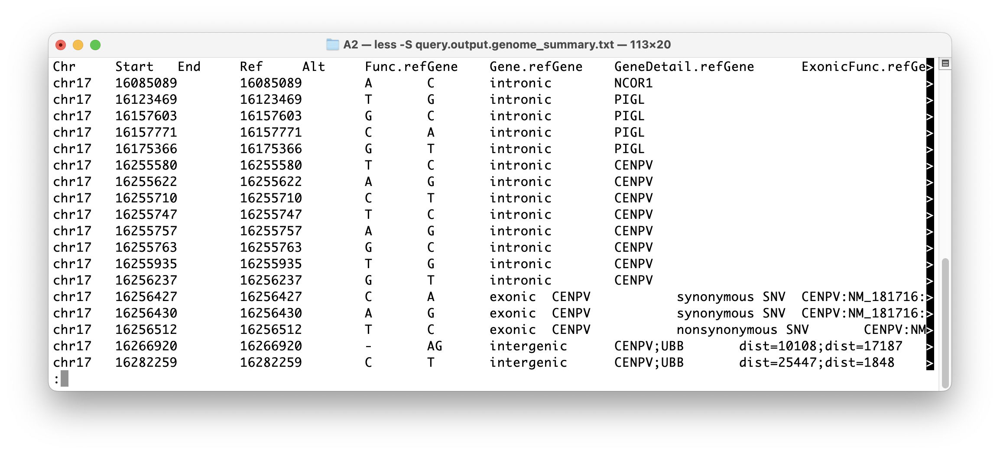

The file`query.output.exome_summary` records the location of variants, the variant allele and the reference allele. The variant type is also noted in the file. The eighth column shows the effect of variants, including frameshift, nonframeshift, synonymous, nonsynonymous. The ninth column shows the type of variants, including SNV, substitution, insertion, deletion and unknown.

Now calculate the number of each variant

```bash
grep 'nonsynonymous SNV' query.output.exome_summary.txt > nonsy-SNV.txt | wc -l
```

Output: 54 (There are 54 nonsynonymous SNV).

```bash
grep 'SNV' query.output.exome_summary.txt > sy-SNV.txt | wc -l
```

Output: 96 (There are SNVs)

Therefore, there are $96-54=42$ synonymous SNV.

```bash
grep 'deletion' query.output.exome_summary.txt > variant-deletion.txt | wc -l 
```

Output: 6 (1 of them is nonframeshift deletion, and 5 of them are frameshift deletion)

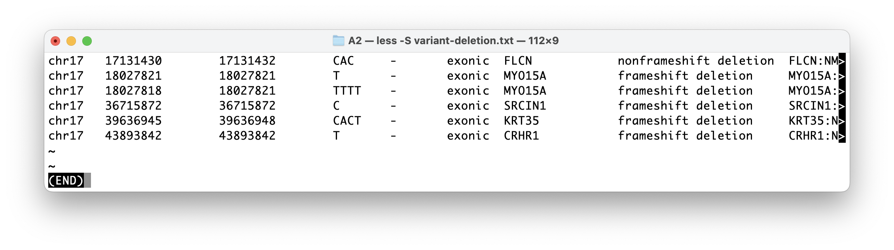

```bash
grep 'insertion' query.output.exome_summary.txt > variant-insertion.txt | wc -l 
```

Output: 5

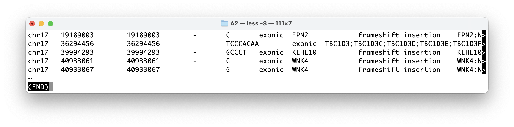


#### References

Koren, S., Walenz, B. P., Berlin, K., Miller, J. R., Bergman, N. H., & Phillippy, A. M. (2017). Canu: scalable and accurate long-read assembly via adaptive k-mer weighting and repeat separation. Genome research, 27(5), 722-736. http://doi.org/10.1101/gr.215087.116 

Chen, S., Zhou, Y., Chen, Y., & Gu, J. (2018). fastp: an ultra-fast all-in-one FASTQ preprocessor. Bioinformatics, 34(17), i884-i890. https://doi.org/10.1093/bioinformatics/bty560 

Danecek, P., Bonfield, J. K., Liddle, J., Marshall, J., Ohan, V., Pollard, M. O., ... & Li, H. (2021). Twelve years of SAMtools and BCFtools. Gigascience, 10(2), giab008. https://doi.org/10.1093/gigascience/giab008 

DePristo, M., Banks, E., Poplin, R. et al. A framework for variation discovery and genotyping using nextgeneration DNA sequencing data. Nat Genet 43, 491–498 (2011). https://doi.org/10.1038/ng.806 

Johansson, L. F., de Weerd, H. A., de Boer, E. N., van Dijk, F., Te Meerman, G. J., Sijmons, R. H., ... & Swertz, M. A. (2018). NIPTeR: an R package for fast and accurate trisomy prediction in non-invasive prenatal testing. BMC bioinformatics, 19(1), 1-5. https://doi.org/10.1186/s12859-018-2557-8 

Simão, F. A., Waterhouse, R. M., Ioannidis, P., Kriventseva, E. V., & Zdobnov, E. M. (2015). BUSCO: assessing genome assembly and annotation completeness with single-copy orthologs. Bioinformatics, 31(19), 3210- 3212. https://doi.org/10.1093/bioinformatics/btv351 

Walker, B. J., Abeel, T., Shea, T., Priest, M., Abouelliel, A., Sakthikumar, S., ... & Earl, A. M. (2014). Pilon: an integrated tool for comprehensive microbial variant detection and genome assembly improvement. PloS one, 9(11), e112963. https://doi.org/10.1371/journal.pone.011296