# BIM3007-Assignment 3

Author: Junyang Deng 120090791

Date: Nov 11 2022

### Requirement

Perform association study, quality control and GWAS on the given data. (`chrALL.ASA.fam`, `chrALL.ASA.bim`, `chrALL.ASA.bed`)

### Procedure

### 1. Number of samples in the dataset

```bash
wc -l chrAll.ASA.fam
```

There are `1018` samples.

### 2. Number of variants in the dataset

```bash
wc -l chrAll.ASA.bim
```

There are `482088` variants.

### 3. Perform QC for **samples**

#### 3.1 Identify individuals with discordant sex info

In this case, a separate XY column already exist, so the `split-x` step can be skipped.

```bash
~/plink --bfile chrAll.ASA --check-sex --out step1
```

Output files: `step1.log`, `step1.sexcheck`

```bash
grep PROBLEM step1.sexcheck | less
grep PROBLEM step1.sexcheck > fail-sexcheck.txt
less fail-sexcheck.txt 
```


Remove samples that failed the sex check

```bash
~/plink --bfile chrAll.ASA --remove fail-sexcheck.txt --make-bed --out step1-sexcheck-data
```

Result:

```
1010 people remaining (removed 8 people)
```

#### 3.2 Identification of individuals with elevated missing data rates

```bash
~/plink --bfile step1-sexcheck-data --missing --out step2
```

Output files: `step2.imiss` (sample missing data), `step2.lmiss` (variant-based missing data) 

```bash
~/plink --bfile step1-sexcheck-data --mind 0.05 --make-bed --out step2-rm-missing
```

Result

```
9 people removed due to missing genotype data (--mind).
```

#### 3.3 LD pruning and remove individuals with high heterozygosity

First check heterozygosity

```bash
~/plink --bfile step2-rm-missing --het --out step3
```

Output file: `step3.het`


```bash
~/plink --bfile step2-rm-missing --indep-pairwise 50 5 0.1 --out step3-LD
```

Output files: `step3-LD.prune.in` and `step3-LD.prune.out`

```bash
~/plink --bfile step2-rm-missing --extract step3-LD.prune.in --make-bed --out step3-LD-pruned
```

Result

```
--extract: 138140 variants remaining.
```

Check the heterozygosity rate again using the pruned data

```bash
~/plink --bfile step3-LD-pruned --het --out step3-pruned
```

Output file: `step3-pruned.het`


A barplot is drawn from `step3-pruned.het` as follow (the red dashed lines are on `y=-0.05` and `y=0.05` separately). Then, removed samples with abnormal rate of heterozygosity. 

```R
# codes for the plot
library(ggplot2)
data <- read.table('step3-pruned.het', header=T)
data$n <- 1:nrow(data)
ggplot(data=data, aes(x=n,y=F))+
  geom_hline(aes(yintercept=0.05), color='red',linetype='dashed')+
  geom_hline(aes(yintercept=-0.05), color='red',linetype='dashed')+
  geom_point(size=0.3, alpha=0.5)+
  ggtitle("Summary of the heterozygosity rate")+
  xlab('')+
  ylab('Heterozygosity Rate')+
  ylim(c(-0.2, 0.2))+
  xlim(c(0, 1000))
```

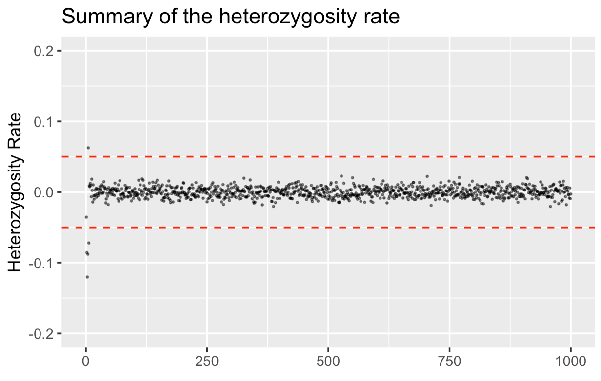


Extract the samples with abnormal heterozygosity rate (> 0.05 or < -0.05) using the code 

```bash
awk '$6 > 0.05 || $6 < -0.05' step3-pruned.het | less > fail-het-check.txt
```


```bash
~/plink --bfile step3-LD-pruned --remove fail-het-check.txt --make-bed --out step3-het-pruned
```

Result: `5` samples are removed. (996 people remained.)

#### 3.4 remove IBD

```bash
~/plink --bfile step3-het-pruned --genome --out step4-IBD
```

Output file: `step4-IBD.genome`

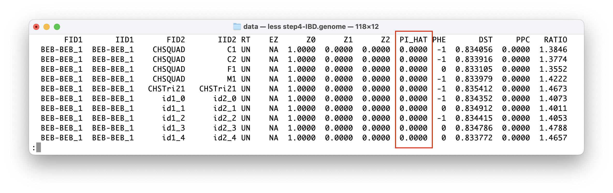

Visualize the PI_HAT information:

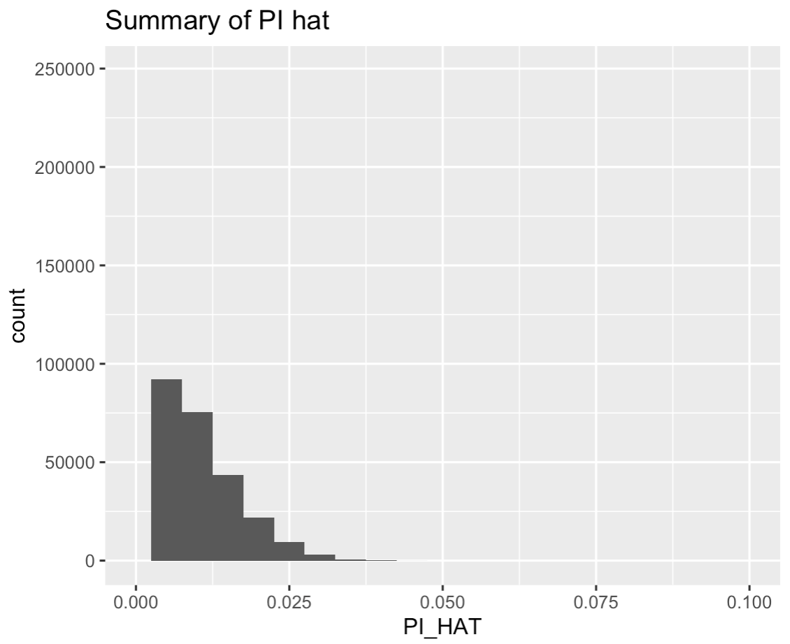

Extract potential related samples:

```bash
awk '{ if ($10 > 0.185) print $0 }' step4-IBD.genome > fail-IBD.txt
```

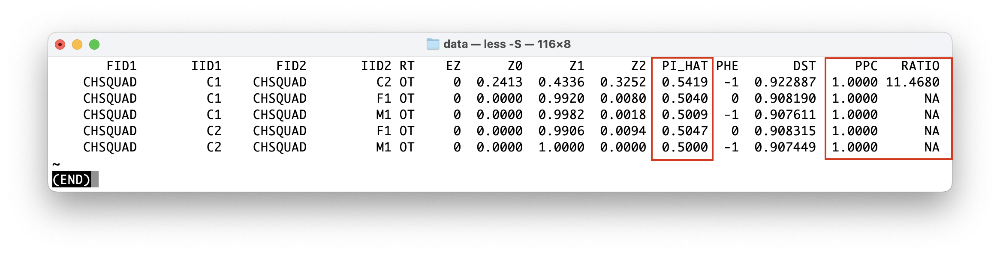

Remove them:

```bash
~/plink --bfile step3-het-pruned --remove fail-IBD.txt --make-bed --out step4-IBD-pruned
```

Result:

```
--remove: 994 people remaining
```

#### 3.5 Solve the stratification problem

```bash
~/plink --bfile step4-IBD-pruned --pca --out step5-pca
```

Output files: `step5-pca.eigenval` and `step5-pca.eigenvec`

PCA visualization

```R
# following lines are run in R
library(ggplot2)
data <- read.table('./step5-pca.eigenvec',header=T)
data <- data[,3:ncol(data)]
names(data) <- paste0('PC',1:ncol(data)) # change the name of columns into PC1, PC2, ..., PCn
ggplot(data=data)+
	geom_point(aes(x=PC1, y=PC2))+
	labs(title="PCA plot", x ="PC1", y = "PC2")
```

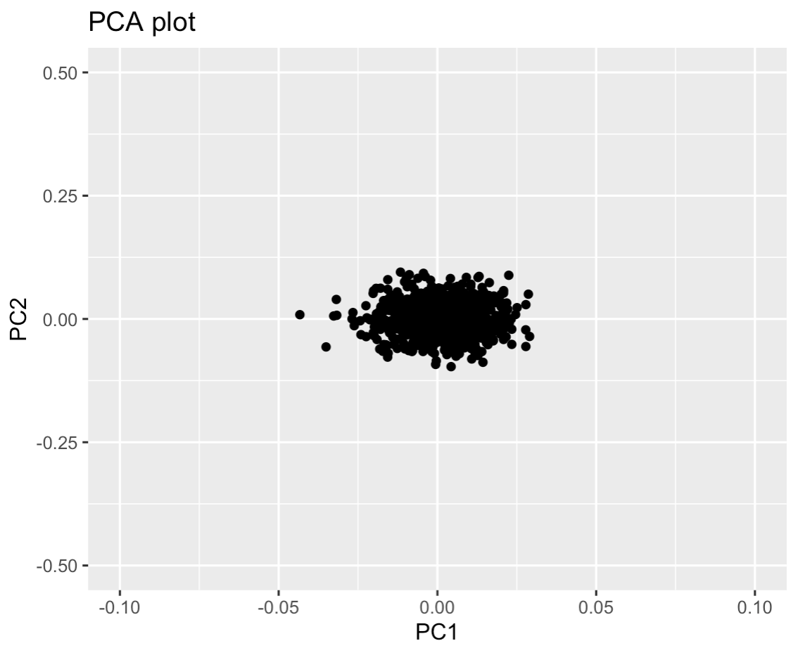

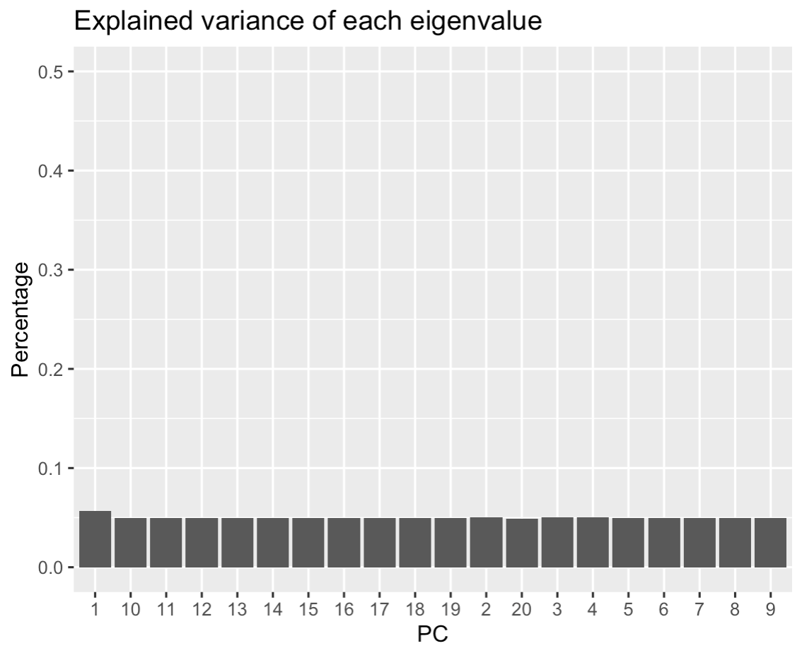

We can see from the PCA scatter plot and the variance plot that the sample is very homogenous. Therefore nothing should be removed.

### 4. Perform QC for genetic variants

#### 4.1 (Step 6) Identify and remove low minor allele frequency SNPs

```bash
~/plink --bfile step4-IBD-pruned --freq --out step6-maf # calculate frq
~/plink --bfile step4-IBD-pruned --maf 0.01 --make-bed --out step6-clean-maf # remove
```

output: `step6-maf.frq`

Result:

```
415 variants removed due to minor allele threshold(s)
137725 variants and 994 people pass filters and QC.
Among remaining phenotypes, 490 are cases and 498 are controls.  (6 phenotypes
are missing.)
```

#### 4.2 (Step 7) Remove SNP with high missingness

```bash
~/plink --bfile step6-clean-maf --missing --out step7-miss # calculate
# exclude individual (mind) and SNP (geno)
~/plink --bfile step6-clean-maf --mind 0.05 --geno 0.05 --make-bed --out step7-miss
```

Result

```
0 people removed due to missing genotype data (--mind).
14 variants removed due to missing genotype data (--geno).
```

#### 4.3 (Step 8) Remove SNP with differentially missingness

```bash
~/plink --bfile step7-miss --test-missing --out step8-dif-miss
```

Output: `step8-dif-miss.missing`

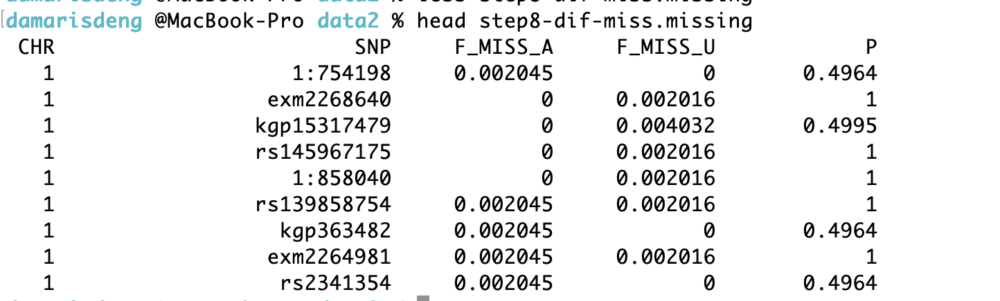

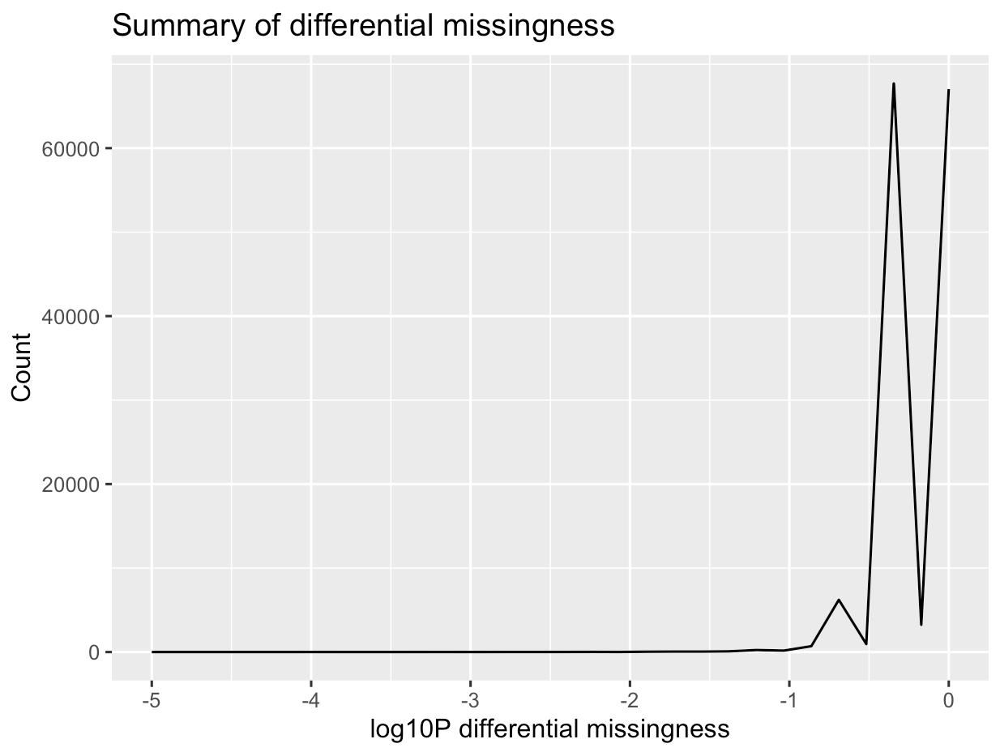

Extract variants with high differentially missingness (P < 5e-04)

```bash
awk '{if ($5 < 0.0001) print $2}' step8-dif-miss.missing | less
```

No output in this step. 

#### 4.4 (Step 9) Remove Hardy-Weinberg equilibrium (HWE)

```bash
~/plink --bfile step7-miss --hardy --out step9 
```

Output: `step9.hwe`

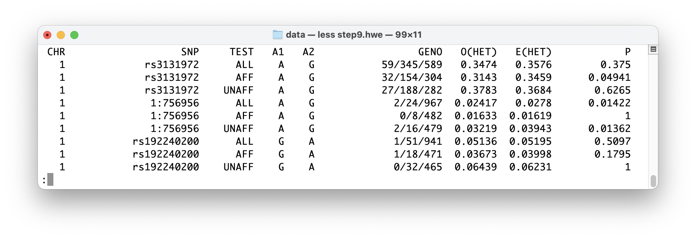

```bash
~/plink --bfile step7-miss --hwe 5e-08 --make-bed --out step9-hwe
```

Result:

```
--hwe: 8 variants removed due to Hardy-Weinberg exact test.
137703 variants and 994 people pass filters and QC.
```

### 5. Perform association tests, show Manhattan plot

After quality control steps, among the remaining phenotypes, 490 are cases and 497 are controls.

```
~/plink --bfile step9-hwe --assoc --out qc
```

Output: `qc.assoc`

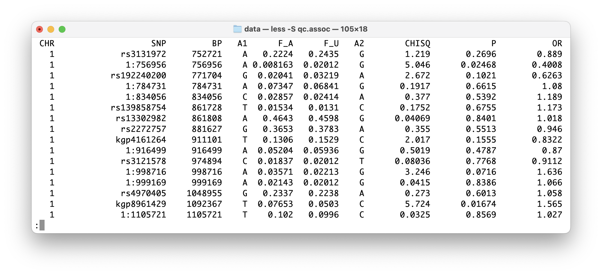

做到这

Use R to find the most significant allele

```R
data <- read.table('./qc.assoc', header=T)
head(data)
sorted <- data[order(data$P),]

data[which.min(data$P),]
```

Output

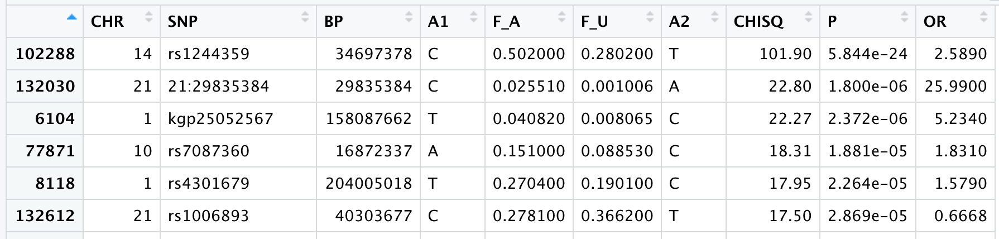

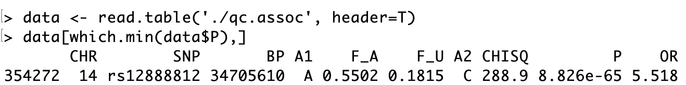

Before QC


Manhattan plots before and after QC

```R
# sample code
library(qqman)
test <- read.table('./qc.assoc', header=T) # or before-qc.assoc
manhattan(test, main="Manhattan Plot", ylim=c(0,25), cex=0.6, cex.axis=0.9, col=c("blue4", "orange3"), chrlabs=c(1:22, "P","Q"))
```


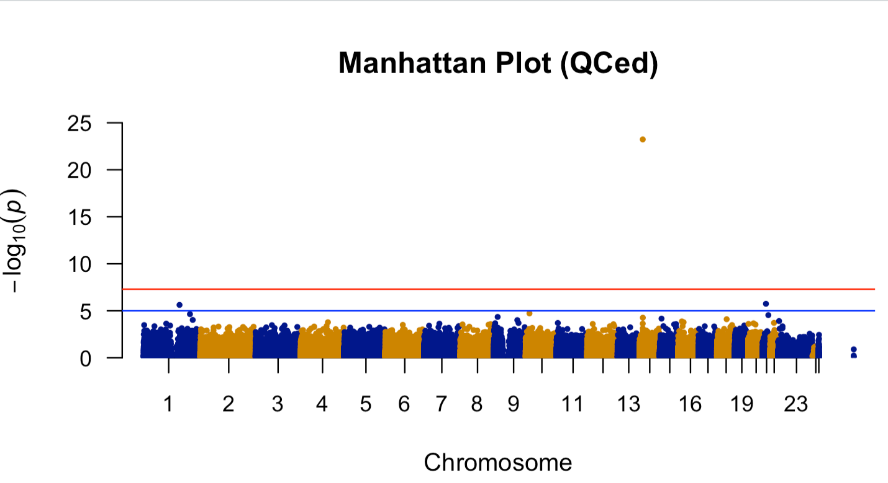

### QQ plot

Calculate inflation factor (using P-value)

Before QC

```R
# inflation
gwasResults <- read.table('./before-qc.assoc', header=T)
p_value2 <- gwasResults$P
z2 <- qnorm(p_value2 / 2)
lambda2 <- round(median(z2^2, na.rm = TRUE) / 0.454, 3)
lambda
```

`[1] 1.195`

```R
# QQ plot
qq(gwasResults$P, main = "Q-Q plot of GWAS p-values (No QC)", xlim = c(0, 7), ylim = c(0,12), pch = 18, col = "blue4", cex = 1, las = 1)
```

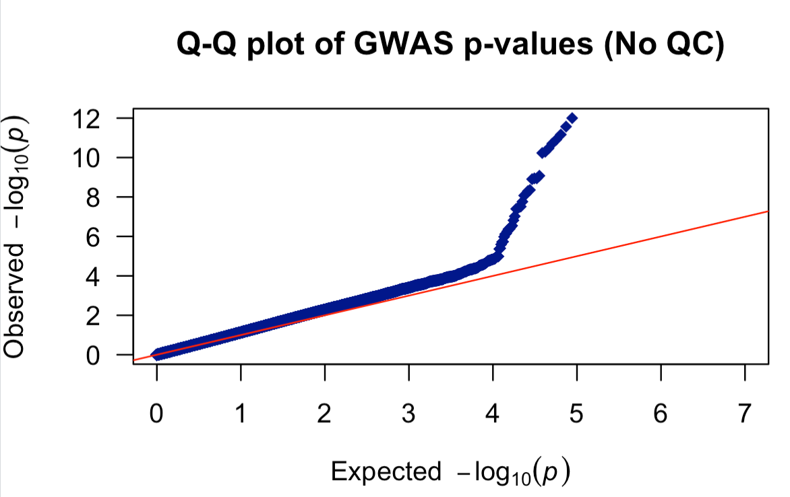

After QC

```R
# inflation
gwasResult <- read.table('./qc.assoc', header=T)
p_value <- gwasResult$P
z <- qnorm(p_value / 2)
lambda <- round(median(z^2, na.rm = TRUE) / 0.454, 3) # qchisq(0.5, 1)=0.454
```

`[1] 1.02`

```R
# QQ plot
qq(gwasResult$P, main = "Q-Q plot of GWAS p-values (QCed)", xlim = c(0, 7), ylim = c(0,    12), pch = 18, col = "blue4", cex = 1.5, las = 1)
```

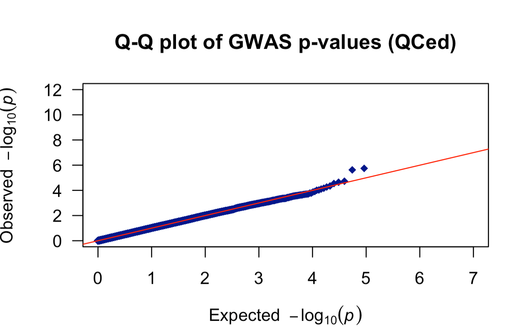

